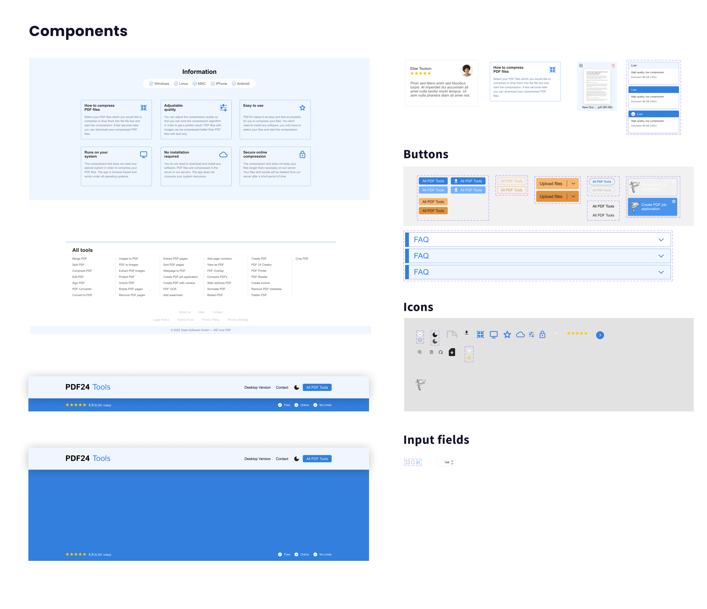
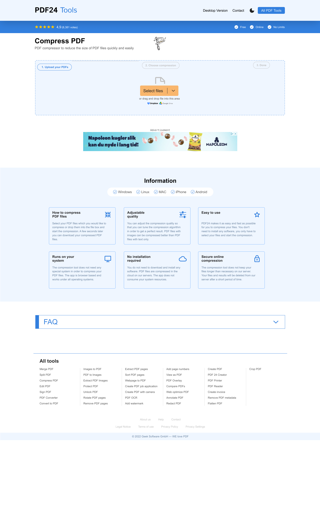
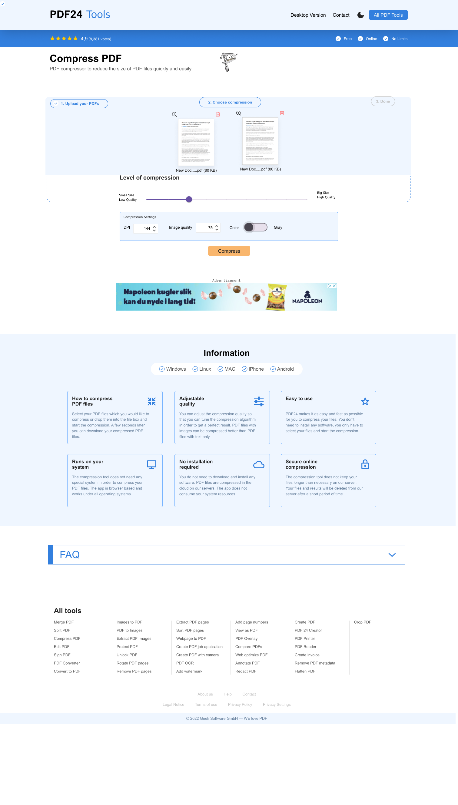
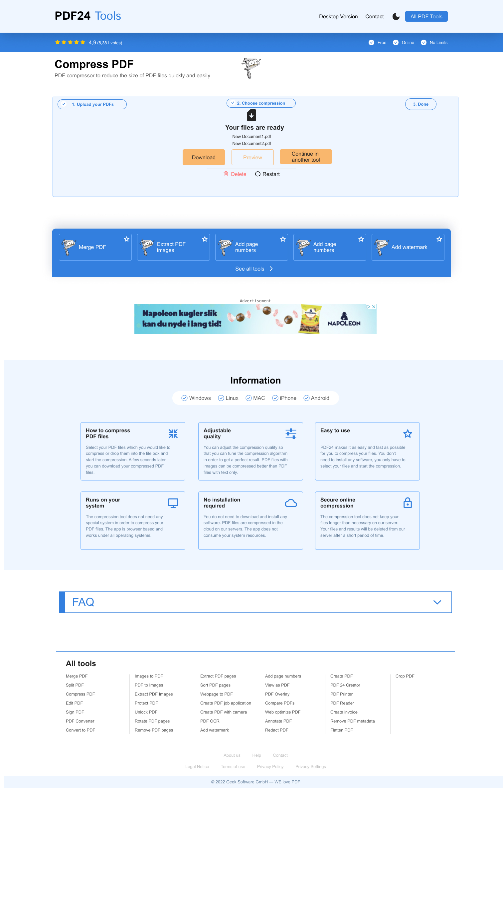

# PDF Uploader

[TRY AT https://pdf-uploader-iota.vercel.app/](https://pdf-uploader-iota.vercel.app/)
A streamlined and efficient web application for uploading and compressing PDFs.

## Introduction

This project focuses on building a client-side, static HTML/JavaScript application that interacts with a backend via API calls. It's designed to provide a user-friendly interface for uploading and compressing PDFs, adhering to the latest web standards for SEO and performance.

## Technologies Used

- React (with Next.js for server-side rendering and improved page speed)
- Tailwind CSS for styling
- API integration for PDF processing

## Project Background

The project was developed as part of a technical assessment challenge, aiming to recreate a specific feature from an existing website, with emphasis on clean API integration, responsive design, and efficient code.

## Features

- Mobile responsive header
- File uploading functionality complete with configuration and downloading options
- Clean, intuitive UI with a focus on usability

## Thought Process and Scope Management

### Understanding the Requirement

Upon reviewing the provided Figma file and current website, it was evident that the design contained numerous components. Key points considered:

- Necessary components for a functional and effective interface
- SEO and performance implications
- Mobile responsiveness and user experience

Designs:

| Design Name             | Image                                         |
| ----------------------- | --------------------------------------------- |
| Components              |         |
| Upload PDF Page         |       |
| Choose Compression Page |  |
| Download Page           |            |

### Decision to Scope Down

While the original design was comprehensive, it included components that would extend the development time beyond the project's scope. To ensure efficiency without compromising on quality, the following decisions were made:

- Focus on core functionalities: file upload, processing, and download
- Prioritize mobile responsiveness and performance
- Simplify the design to essential components only

This approach allowed for a more focused and manageable project, ensuring that key competencies like API integration, responsive design, and code quality were adequately demonstrated.

## SEO Score

## Future Improvements

- Addition of more interactive elements as per original design
- Further optimization for page speed and SEO
- Expansion of file processing options

## What I Learned

Through the development of this project, I gained several key insights and enhanced various skills:

- **Handling File Uploads in Next.js:** Mastered the intricacies of managing file uploads using Next.js and its API routing capabilities, ensuring efficient and secure data handling.

- **Step Wizard Implementation via Context:** Honed my skills in creating a multi-step wizard interface, utilizing Providers and Context in React. This approach streamlined the user experience for complex interactions.

- **Dynamic Progress Indication:** Developed a responsive and meaningful progress section that dynamically updates in response to API communications, enhancing user feedback and engagement.

- **Optimized State Management:** Learned the importance of judicious use of state management libraries. This project underscored that not every inter-component communication requires complex state management solutions, promoting simpler and more efficient coding practices.

- **Displaying PDFs in Web Applications:** Discovered the necessity of using `URL.createObjectURL(file)` to correctly display PDFs within an iframe, enriching my understanding of handling various file formats in web development.

## Initial completion date and duration spent

September 2023 - 10hours+
